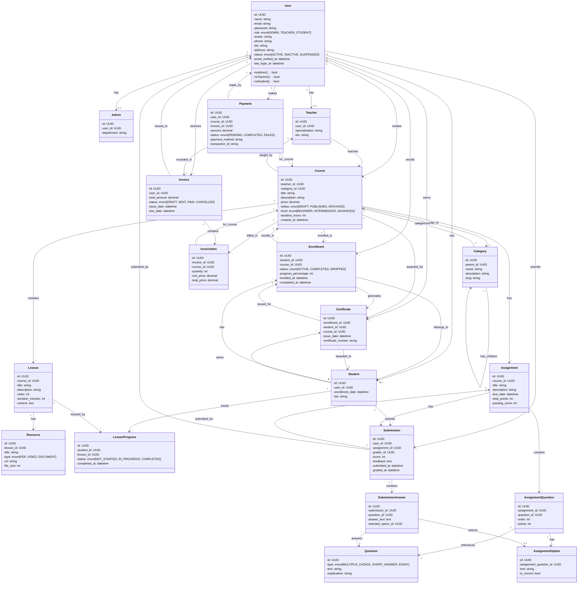

# E-Learning API - Class Diagram

```mermaid
classDiagram
    class User {
        -id: UUID
        -name: string
        -email: string
        -password: string
        -role: enum[ADMIN, TEACHER, STUDENT]
        -avatar: string
        -phone: string
        -bio: string
        -address: string
        -status: enum[ACTIVE, INACTIVE, SUSPENDED]
        -email_verified_at: datetime
        -last_login_at: datetime
        +isAdmin(): bool
        +isTeacher(): bool
        +isStudent(): bool
    }

    class Admin {
        -id: UUID
        -user_id: UUID
        -department: string
    }

    class Teacher {
        -id: UUID
        -user_id: UUID
        -specialization: string
        -bio: string
    }

    class Student {
        -id: UUID
        -user_id: UUID
        -enrollment_date: datetime
        -bio: string
    }

    class Course {
        -id: UUID
        -teacher_id: UUID
        -category_id: UUID
        -title: string
        -description: string
        -price: decimal
        -status: enum[DRAFT, PUBLISHED, ARCHIVED]
        -level: enum[BEGINNER, INTERMEDIATE, ADVANCED]
        -duration_hours: int
        -created_at: datetime
    }

    class Category {
        -id: UUID
        -parent_id: UUID
        -name: string
        -description: string
        -slug: string
    }

    class Lesson {
        -id: UUID
        -course_id: UUID
        -title: string
        -description: string
        -order: int
        -duration_minutes: int
        -content: text
    }

    class Resource {
        -id: UUID
        -lesson_id: UUID
        -title: string
        -type: enum[PDF, VIDEO, DOCUMENT]
        -url: string
        -file_size: int
    }

    class Assignment {
        -id: UUID
        -course_id: UUID
        -title: string
        -description: string
        -due_date: datetime
        -total_points: int
        -passing_score: int
    }

    class AssignmentQuestion {
        -id: UUID
        -assignment_id: UUID
        -question_id: UUID
        -order: int
        -points: int
    }

    class Question {
        -id: UUID
        -type: enum[MULTIPLE_CHOICE, SHORT_ANSWER, ESSAY]
        -text: string
        -explanation: string
    }

    class AssignmentOption {
        -id: UUID
        -assignment_question_id: UUID
        -text: string
        -is_correct: bool
    }

    class Enrollment {
        -id: UUID
        -student_id: UUID
        -course_id: UUID
        -status: enum[ACTIVE, COMPLETED, DROPPED]
        -progress_percentage: int
        -enrolled_at: datetime
        -completed_at: datetime
    }

    class LessonProgress {
        -id: UUID
        -student_id: UUID
        -lesson_id: UUID
        -status: enum[NOT_STARTED, IN_PROGRESS, COMPLETED]
        -completed_at: datetime
    }

    class Submission {
        -id: UUID
        -user_id: UUID
        -assignment_id: UUID
        -grader_id: UUID
        -score: int
        -feedback: text
        -submitted_at: datetime
        -graded_at: datetime
    }

    class SubmissionAnswer {
        -id: UUID
        -submission_id: UUID
        -question_id: UUID
        -answer_text: text
        -selected_option_id: UUID
    }

    class Certificate {
        -id: UUID
        -enrollment_id: UUID
        -student_id: UUID
        -course_id: UUID
        -issue_date: datetime
        -certificate_number: string
    }

    class Payment {
        -id: UUID
        -user_id: UUID
        -course_id: UUID
        -invoice_id: UUID
        -amount: decimal
        -status: enum[PENDING, COMPLETED, FAILED]
        -payment_method: string
        -transaction_id: string
    }

    class Invoice {
        -id: UUID
        -user_id: UUID
        -total_amount: decimal
        -status: enum[DRAFT, SENT, PAID, CANCELLED]
        -issue_date: datetime
        -due_date: datetime
    }

    class InvoiceItem {
        -id: UUID
        -invoice_id: UUID
        -course_id: UUID
        -quantity: int
        -unit_price: decimal
        -total_price: decimal
    }

    User "1" --> "0..1" Admin : has
    User "1" --> "0..1" Teacher : has
    User "1" --> "0..1" Student : has
    User "1" --> "*" Course : creates
    User "1" --> "*" Submission : submits
    User "1" --> "*" Enrollment : enrolls
    User "1" --> "*" Certificate : earns
    User "1" --> "*" Payment : makes
    User "1" --> "*" Invoice : receives

    Teacher "1" --> "*" Course : teaches
    Student "1" --> "*" Enrollment : has
    Student "1" --> "*" Submission : submits
    Student "1" --> "*" LessonProgress : tracks
    Student "1" --> "*" Certificate : earns

    Course "1" --> "*" Lesson : contains
    Course "1" --> "*" Assignment : has
    Course "1" --> "*" Enrollment : enrolled_in
    Course "1" --> "*" Certificate : awarded_for
    Course "1" --> "*" InvoiceItem : billed_in
    Course "*" --> "1" Category : belongs_to
    Course "*" --> "1" Teacher : taught_by

    Category "1" --> "*" Category : has_children
    Category "1" --> "*" Course : categorizes

    Lesson "1" --> "*" Resource : has
    Lesson "1" --> "*" LessonProgress : tracked_by

    Assignment "1" --> "*" AssignmentQuestion : contains
    Assignment "1" --> "*" Submission : has

    AssignmentQuestion "1" --> "1" Question : references
    AssignmentQuestion "1" --> "*" AssignmentOption : has

    Submission "1" --> "*" SubmissionAnswer : contains
    Submission "*" --> "1" Assignment : submitted_for
    Submission "*" --> "1" User : submitted_by

    SubmissionAnswer "*" --> "1" Question : answers
    SubmissionAnswer "*" --> "0..1" AssignmentOption : selects

    Enrollment "1" --> "*" Certificate : generates
    Enrollment "*" --> "1" Course : enrolls_in
    Enrollment "*" --> "1" Student : belongs_to

    Certificate "*" --> "1" Enrollment : issued_for
    Certificate "*" --> "1" Student : awarded_to

    Payment "*" --> "1" User : made_by
    Payment "*" --> "1" Course : for_course
    Payment "*" --> "1" Invoice : recorded_in

    Invoice "1" --> "*" InvoiceItem : contains
    Invoice "*" --> "1" User : issued_to

    InvoiceItem "*" --> "1" Course : for_course
```
