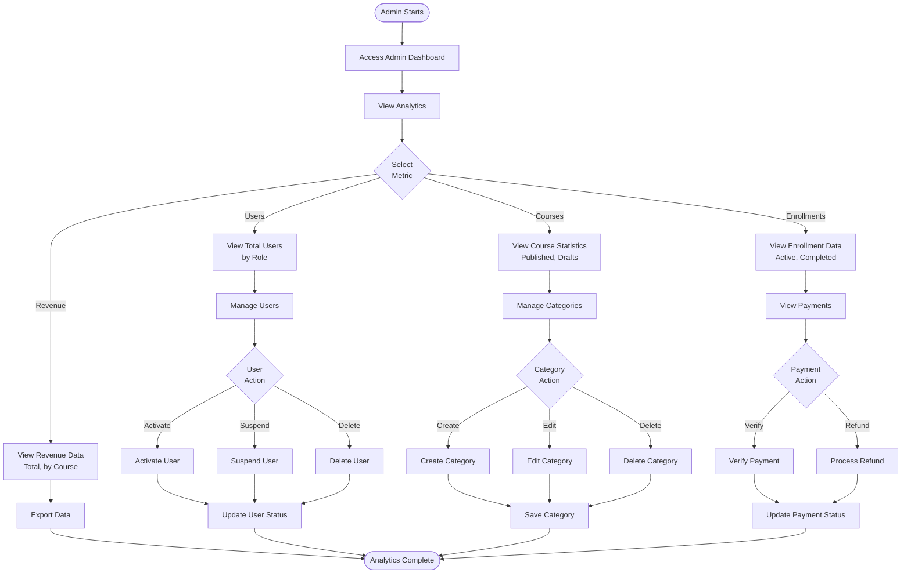

# E-Learning API - Activity Diagram

## Student Course Enrollment and Learning Flow

```mermaid
graph TD
    Start([Student Starts]) --> Browse["Browse Available Courses"]
    Browse --> Search{Search or<br/>Filter?}
    Search -->|Search| SearchCourses["Search by Title/Description"]
    Search -->|Filter| FilterCourses["Filter by Category/Level"]
    SearchCourses --> ViewCourse["View Course Details"]
    FilterCourses --> ViewCourse

    ViewCourse --> CheckPrice{Course<br/>Paid?}
    CheckPrice -->|Free| Enroll["Enroll in Course"]
    CheckPrice -->|Paid| Payment["Proceed to Payment"]
    Payment --> ProcessPayment["Process Payment via PayPal"]
    ProcessPayment --> PaymentSuccess{Payment<br/>Successful?}
    PaymentSuccess -->|No| PaymentFailed["Payment Failed"]
    PaymentFailed --> ViewCourse
    PaymentSuccess -->|Yes| GenerateInvoice["Generate Invoice"]
    GenerateInvoice --> Enroll

    Enroll --> CreateEnrollment["Create Enrollment Record"]
    CreateEnrollment --> ViewLessons["View Course Lessons"]
    ViewLessons --> SelectLesson["Select Lesson"]
    SelectLesson --> ViewLesson["View Lesson Content"]
    ViewLesson --> CompleteLesson{Complete<br/>Lesson?}
    CompleteLesson -->|No| SelectLesson
    CompleteLesson -->|Yes| UpdateProgress["Update Lesson Progress"]
    UpdateProgress --> CheckAssignment{Assignment<br/>Available?}

    CheckAssignment -->|Yes| ViewAssignment["View Assignment"]
    ViewAssignment --> SubmitAssignment["Submit Assignment"]
    SubmitAssignment --> CreateSubmission["Create Submission Record"]
    CreateSubmission --> NotifyTeacher["Notify Teacher"]
    NotifyTeacher --> WaitGrading["Wait for Grading"]
    WaitGrading --> GradeReceived{Grade<br/>Received?}
    GradeReceived -->|No| WaitGrading
    GradeReceived -->|Yes| ViewGrade["View Grade & Feedback"]
    ViewGrade --> CheckMoreLessons

    CheckAssignment -->|No| CheckMoreLessons{More<br/>Lessons?}
    CheckMoreLessons -->|Yes| SelectLesson
    CheckMoreLessons -->|No| CheckCompletion["Check Course Completion"]

    CheckCompletion --> AllLessonsComplete{All Lessons<br/>Completed?}
    AllLessonsComplete -->|No| SelectLesson
    AllLessonsComplete -->|Yes| CheckPassingScore{Passing<br/>Score Met?}

    CheckPassingScore -->|No| End1([Course Not Completed])
    CheckPassingScore -->|Yes| GenerateCertificate["Generate Certificate"]
    GenerateCertificate --> IssueCertificate["Issue Certificate"]
    IssueCertificate --> UpdateEnrollment["Update Enrollment Status"]
    UpdateEnrollment --> End2([Course Completed Successfully])
```

## Teacher Course Creation and Grading Flow

```mermaid
graph TD
    Start([Teacher Starts]) --> CreateCourse["Create New Course"]
    CreateCourse --> AddCourseDetails["Add Course Details<br/>Title, Description, Price"]
    AddCourseDetails --> SelectCategory["Select Category"]
    SelectCategory --> SetLevel["Set Course Level"]
    SetLevel --> SaveCourse["Save Course as Draft"]

    SaveCourse --> AddLessons["Add Lessons to Course"]
    AddLessons --> CreateLesson["Create Lesson"]
    CreateLesson --> AddLessonContent["Add Lesson Content"]
    AddLessonContent --> AddResources{Add<br/>Resources?}
    AddResources -->|Yes| UploadResource["Upload Resource<br/>PDF, Video, etc"]
    UploadResource --> MoreResources{More<br/>Resources?}
    MoreResources -->|Yes| UploadResource
    MoreResources -->|No| MoreLessons
    AddResources -->|No| MoreLessons{More<br/>Lessons?}
    MoreLessons -->|Yes| CreateLesson
    MoreLessons -->|No| AddAssignments["Add Assignments"]

    AddAssignments --> CreateAssignment["Create Assignment"]
    CreateAssignment --> AddQuestions["Add Questions"]
    AddQuestions --> CreateQuestion["Create Question<br/>Multiple Choice/Essay"]
    CreateQuestion --> AddOptions{Add<br/>Options?}
    AddOptions -->|Yes| AddOption["Add Answer Option"]
    AddOption --> MoreOptions{More<br/>Options?}
    MoreOptions -->|Yes| AddOption
    MoreOptions -->|No| MoreQuestions
    AddOptions -->|No| MoreQuestions{More<br/>Questions?}
    MoreQuestions -->|Yes| CreateQuestion
    MoreQuestions -->|No| MoreAssignments{More<br/>Assignments?}
    MoreAssignments -->|Yes| CreateAssignment
    MoreAssignments -->|No| PublishCourse["Publish Course"]

    PublishCourse --> WaitEnrollments["Wait for Student Enrollments"]
    WaitEnrollments --> CheckSubmissions{Student<br/>Submissions?}
    CheckSubmissions -->|No| WaitEnrollments
    CheckSubmissions -->|Yes| ViewSubmission["View Student Submission"]
    ViewSubmission --> GradeSubmission["Grade Submission"]
    GradeSubmission --> ProvideFeedback["Provide Feedback"]
    ProvideFeedback --> SaveGrade["Save Grade & Feedback"]
    SaveGrade --> NotifyStudent["Notify Student"]
    NotifyStudent --> MoreSubmissions{More<br/>Submissions?}
    MoreSubmissions -->|Yes| ViewSubmission
    MoreSubmissions -->|No| End([Grading Complete])
```

## Admin Dashboard and Analytics Flow

```mermaid
graph TD
    Start([Admin Starts]) --> Dashboard["Access Admin Dashboard"]
    Dashboard --> ViewAnalytics["View Analytics"]
    ViewAnalytics --> CheckMetrics{Select<br/>Metric}

    CheckMetrics -->|Users| ViewUsers["View Total Users<br/>by Role"]
    CheckMetrics -->|Courses| ViewCourses["View Course Statistics<br/>Published, Drafts"]
    CheckMetrics -->|Enrollments| ViewEnrollments["View Enrollment Data<br/>Active, Completed"]
    CheckMetrics -->|Revenue| ViewRevenue["View Revenue Data<br/>Total, by Course"]

    ViewUsers --> ManageUsers["Manage Users"]
    ManageUsers --> UserAction{User<br/>Action}
    UserAction -->|Activate| ActivateUser["Activate User"]
    UserAction -->|Suspend| SuspendUser["Suspend User"]
    UserAction -->|Delete| DeleteUser["Delete User"]
    ActivateUser --> UpdateUserStatus["Update User Status"]
    SuspendUser --> UpdateUserStatus
    DeleteUser --> UpdateUserStatus

    ViewCourses --> ManageCategories["Manage Categories"]
    ManageCategories --> CategoryAction{Category<br/>Action}
    CategoryAction -->|Create| CreateCategory["Create Category"]
    CategoryAction -->|Edit| EditCategory["Edit Category"]
    CategoryAction -->|Delete| DeleteCategory["Delete Category"]
    CreateCategory --> SaveCategory["Save Category"]
    EditCategory --> SaveCategory
    DeleteCategory --> SaveCategory

    ViewEnrollments --> ViewPayments["View Payments"]
    ViewPayments --> PaymentAction{Payment<br/>Action}
    PaymentAction -->|Verify| VerifyPayment["Verify Payment"]
    PaymentAction -->|Refund| ProcessRefund["Process Refund"]
    VerifyPayment --> UpdatePaymentStatus["Update Payment Status"]
    ProcessRefund --> UpdatePaymentStatus

    ViewRevenue --> ExportData["Export Data"]
    ExportData --> End([Analytics Complete])
    UpdateUserStatus --> End
    SaveCategory --> End
    UpdatePaymentStatus --> End
```
