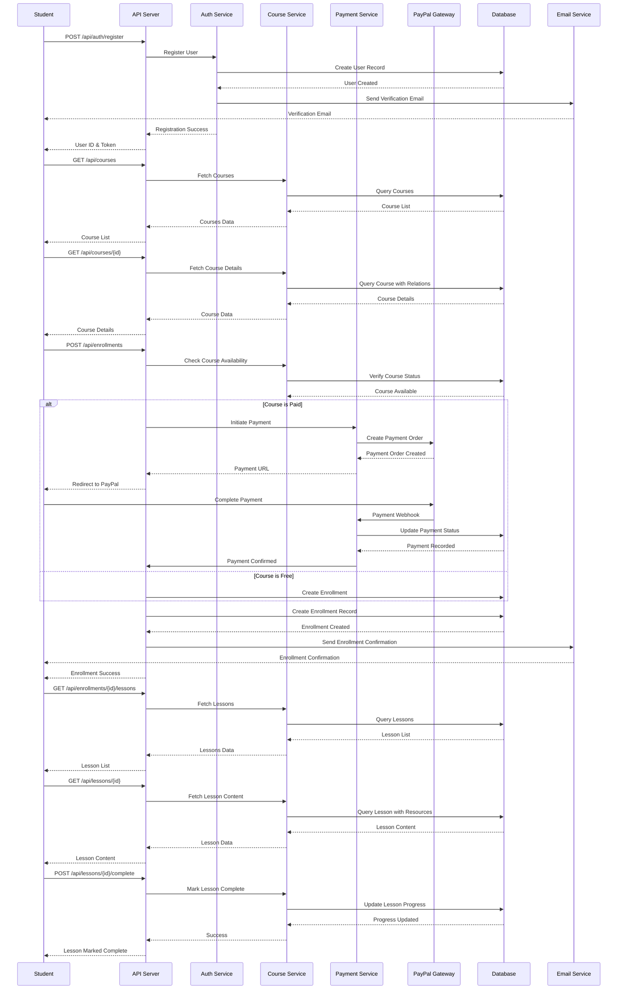
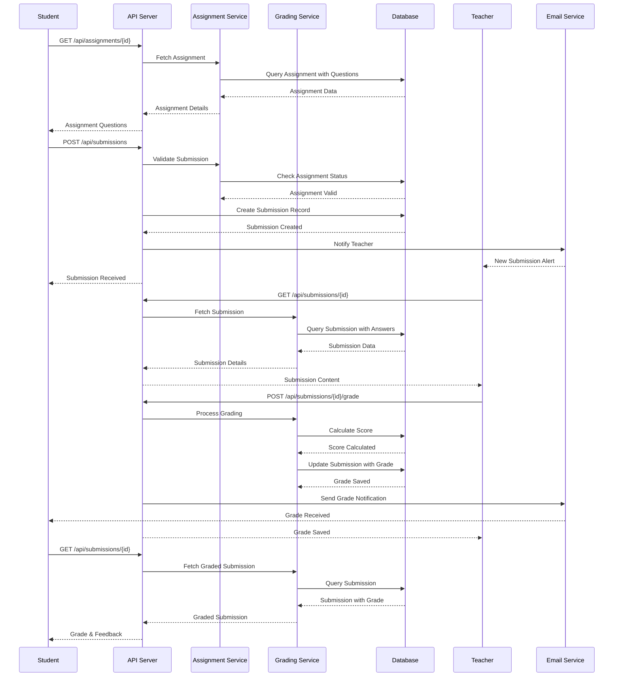
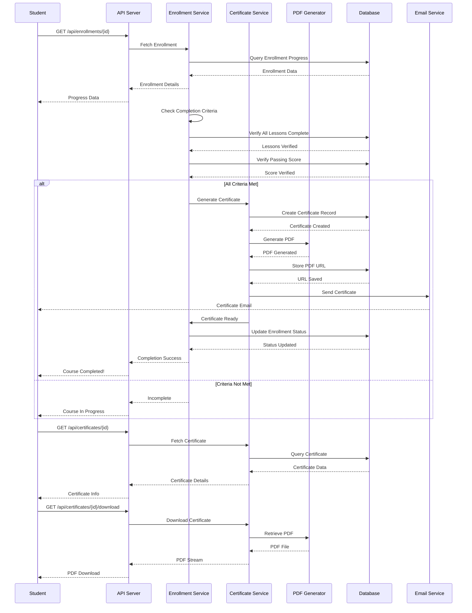
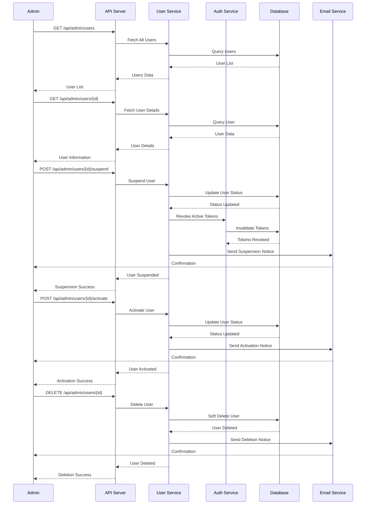

# E-Learning API - Sequence Diagram

## Student Enrollment and Payment Flow

## Assignment Submission and Grading Flow

## Certificate Generation and Course Completion Flow

## Admin User Management Flow

