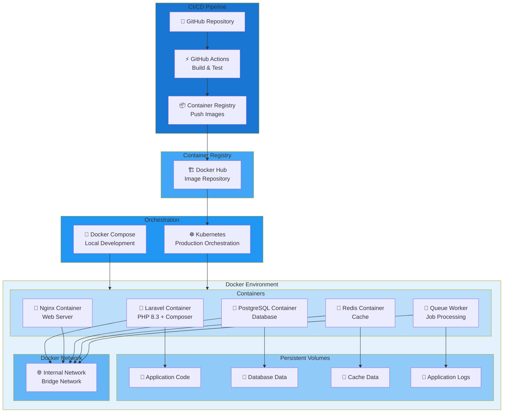
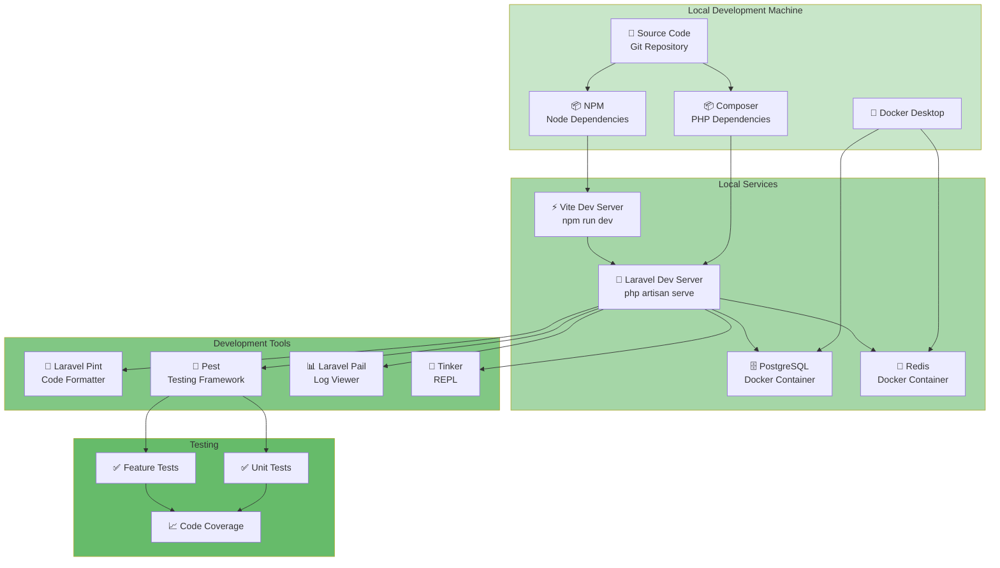

# E-Learning API - Deployment Diagram

## Production Deployment Architecture

```mermaid
graph TB
    subgraph Client["Client Layer"]
        Web["🌐 Web Browser"]
        Mobile["📱 Mobile App"]
        Desktop["💻 Desktop Client"]
    end

    subgraph CDN["CDN & Static Assets"]
        CloudFlare["CloudFlare CDN"]
        S3["AWS S3<br/>Static Files"]
    end

    subgraph LoadBalancer["Load Balancing"]
        LB["🔄 Load Balancer<br/>Nginx/HAProxy"]
    end

    subgraph AppServers["Application Servers"]
        App1["Laravel App<br/>Instance 1"]
        App2["Laravel App<br/>Instance 2"]
        App3["Laravel App<br/>Instance 3"]
    end

    subgraph Cache["Caching Layer"]
        Redis["🔴 Redis Cache<br/>Sessions & Cache"]
    end

    subgraph Database["Database Layer"]
        Primary["🗄️ PostgreSQL Primary<br/>Master"]
        Replica1["🗄️ PostgreSQL Replica 1<br/>Read-Only"]
        Replica2["🗄️ PostgreSQL Replica 2<br/>Read-Only"]
    end

    subgraph Queue["Queue & Jobs"]
        Queue["📋 Job Queue<br/>Database-backed"]
        Worker1["⚙️ Queue Worker 1"]
        Worker2["⚙️ Queue Worker 2"]
    end

    subgraph Storage["File Storage"]
        LocalStorage["💾 Local Storage<br/>Certificates, Invoices"]
        S3Storage["☁️ AWS S3<br/>Course Resources"]
    end

    subgraph Email["Email Service"]
        Brevo["📧 Brevo SMTP<br/>Email Provider"]
    end

    subgraph Payment["Payment Gateway"]
        PayPal["💳 PayPal API<br/>Payment Processing"]
    end

    subgraph Monitoring["Monitoring & Logging"]
        Logs["📊 Application Logs<br/>Laravel Pail"]
        Monitoring["📈 Monitoring<br/>New Relic/DataDog"]
        ErrorTracking["🐛 Error Tracking<br/>Sentry"]
    end

    subgraph Security["Security"]
        SSL["🔒 SSL/TLS<br/>Certificates"]
        WAF["🛡️ Web Application<br/>Firewall"]
    end

    Web --> CloudFlare
    Mobile --> CloudFlare
    Desktop --> CloudFlare
    CloudFlare --> S3
    CloudFlare --> WAF
    WAF --> SSL
    SSL --> LB

    LB --> App1
    LB --> App2
    LB --> App3

    App1 --> Redis
    App2 --> Redis
    App3 --> Redis

    App1 --> Primary
    App2 --> Primary
    App3 --> Primary

    Primary --> Replica1
    Primary --> Replica2

    App1 --> Queue
    App2 --> Queue
    App3 --> Queue

    Queue --> Worker1
    Queue --> Worker2

    Worker1 --> LocalStorage
    Worker2 --> LocalStorage
    App1 --> S3Storage
    App2 --> S3Storage
    App3 --> S3Storage

    App1 --> Brevo
    App2 --> Brevo
    App3 --> Brevo

    App1 --> PayPal
    App2 --> PayPal
    App3 --> PayPal

    App1 --> Logs
    App2 --> Logs
    App3 --> Logs
    Logs --> Monitoring
    Logs --> ErrorTracking

    style Client fill:#e1f5ff
    style CDN fill:#fff3e0
    style LoadBalancer fill:#f3e5f5
    style AppServers fill:#e8f5e9
    style Cache fill:#fce4ec
    style Database fill:#ede7f6
    style Queue fill:#f1f8e9
    style Storage fill:#fff9c4
    style Email fill:#e0f2f1
    style Payment fill:#fbe9e7
    style Monitoring fill:#f5f5f5
    style Security fill:#ffebee
```

## Docker Containerized Deployment



## Development Environment Setup



## Coolify Deployment Architecture

```mermaid
graph TB
    subgraph Coolify["Coolify Platform"]
        subgraph Project["Project"]
            Service["🚀 Laravel Service"]
            Database["🗄️ PostgreSQL Service"]
            Redis["🔴 Redis Service"]
        end

        subgraph Monitoring["Built-in Monitoring"]
            Logs["📊 Logs"]
            Stats["📈 Statistics"]
            Alerts["🔔 Alerts"]
        end

        subgraph Backups["Backup Management"]
            DBBackup["💾 Database Backups"]
            FileBackup["💾 File Backups"]
        end
    end

    subgraph Infrastructure["Infrastructure"]
        Server["🖥️ VPS/Dedicated Server"]
        Storage["💾 Storage"]
        Network["🌐 Network"]
    end

    subgraph Domain["Domain & SSL"]
        Domain["🌐 Domain Name"]
        SSL["🔒 SSL Certificate<br/>Let's Encrypt"]
    end

    subgraph Deployment["Deployment"]
        Git["🔗 Git Repository"]
        Webhook["🔄 Git Webhook"]
        AutoDeploy["⚡ Auto Deploy"]
    end

    Service --> Database
    Service --> Redis
    Service --> Logs
    Service --> Stats
    Service --> Alerts

    Database --> DBBackup
    Service --> FileBackup

    Service --> Server
    Database --> Server
    Redis --> Server
    Server --> Storage
    Server --> Network

    Domain --> SSL
    SSL --> Service

    Git --> Webhook
    Webhook --> AutoDeploy
    AutoDeploy --> Service

    style Coolify fill:#e1bee7
    style Project fill:#ce93d8
    style Monitoring fill:#ba68c8
    style Backups fill:#ab47bc
    style Infrastructure fill:#9c27b0
    style Domain fill:#8e24aa
    style Deployment fill:#7b1fa2
```
