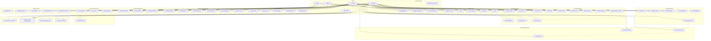

# Laravel API Kit - Use Case Diagram

```mermaid
graph TB
    subgraph Actors
        Admin["👤 Admin"]
        Teacher["👨‍🏫 Teacher"]
        Student["👨‍🎓 Student"]
        System["🔧 System"]
        AI["🤖 AI Assistant"]
    end

    subgraph Authentication
        Register["Register Account"]
        Login["Login"]
        ResetPassword["Reset Password"]
        VerifyEmail["Verify Email"]
        Logout["Logout"]
    end

    subgraph RolePermission
        ManageRoles["Manage Roles"]
        ManagePermissions["Manage Permissions"]
        AssignRoles["Assign Roles to Users"]
        CheckPermissions["Check Permissions"]
    end

    subgraph CourseManagement
        CreateCourse["Create Course"]
        EditCourse["Edit Course"]
        PublishCourse["Publish Course"]
        DeleteCourse["Delete Course"]
        ViewCourses["View Courses"]
        SearchCourses["Search Courses"]
        FilterByCategory["Filter by Category"]
        AssignTeachers["Assign Multiple Teachers"]
    end

    subgraph LessonManagement
        CreateLesson["Create Lesson"]
        EditLesson["Edit Lesson"]
        DeleteLesson["Delete Lesson"]
        AddResources["Add Resources"]
        ViewLessons["View Lessons"]
    end

    subgraph AssignmentManagement
        CreateAssignment["Create Assignment"]
        EditAssignment["Edit Assignment"]
        DeleteAssignment["Delete Assignment"]
        CreateQuestions["Create Questions"]
        ViewAssignments["View Assignments"]
        SetTimeLimit["Set Time Limit"]
    end

    subgraph StudentEnrollment
        EnrollCourse["Enroll in Course"]
        ViewEnrollments["View Enrollments"]
        TrackProgress["Track Progress"]
        DropCourse["Drop Course"]
    end

    subgraph LearningActivities
        ViewLesson["View Lesson"]
        CompleteLesson["Complete Lesson"]
        SubmitAssignment["Submit Assignment"]
        ViewSubmissions["View Submissions"]
        ViewFeedback["View Feedback"]
        StartAssignment["Start Assignment"]
    end

    subgraph GradingAndFeedback
        GradeSubmission["Grade Submission"]
        ProvideFeedback["Provide Feedback"]
        ViewGrades["View Grades"]
    end

    subgraph CertificateManagement
        GenerateCertificate["Generate Certificate"]
        ViewCertificate["View Certificate"]
        DownloadCertificate["Download Certificate"]
    end

    subgraph PaymentAndInvoicing
        ProcessPayment["Process Payment"]
        GenerateInvoice["Generate Invoice"]
        ViewInvoice["View Invoice"]
        DownloadInvoice["Download Invoice"]
    end

    subgraph AdminFunctions
        ManageUsers["Manage Users"]
        ManageCategories["Manage Categories"]
        ViewAnalytics["View Analytics"]
        ManagePayments["Manage Payments"]
        SuspendUser["Suspend/Activate User"]
    end

    subgraph AIFeatures
        GenerateContent["Generate Course Content"]
        SuggestImprovements["Suggest Course Improvements"]
        AutoGrade["Auto-Grade Assignments"]
        GenerateQuestions["Generate Questions"]
    end

    Admin --> ManageUsers
    Admin --> ManageCategories
    Admin --> ViewAnalytics
    Admin --> ManagePayments
    Admin --> ProcessPayment
    Admin --> ManageRoles
    Admin --> ManagePermissions
    Admin --> SuspendUser

    Teacher --> CreateCourse
    Teacher --> EditCourse
    Teacher --> PublishCourse
    Teacher --> DeleteCourse
    Teacher --> CreateLesson
    Teacher --> EditLesson
    Teacher --> AddResources
    Teacher --> CreateAssignment
    Teacher --> EditAssignment
    Teacher --> CreateQuestions
    Teacher --> SetTimeLimit
    Teacher --> GradeSubmission
    Teacher --> ProvideFeedback
    Teacher --> ViewSubmissions
    Teacher --> AssignTeachers

    Student --> Register
    Student --> Login
    Student --> ResetPassword
    Student --> VerifyEmail
    Student --> Logout
    Student --> SearchCourses
    Student --> FilterByCategory
    Student --> ViewCourses
    Student --> EnrollCourse
    Student --> ViewEnrollments
    Student --> TrackProgress
    Student --> DropCourse
    Student --> ViewLesson
    Student --> CompleteLesson
    Student --> StartAssignment
    Student --> SubmitAssignment
    Student --> ViewSubmissions
    Student --> ViewFeedback
    Student --> ViewGrades
    Student --> GenerateCertificate
    Student --> ViewCertificate
    Student --> DownloadCertificate
    Student --> ProcessPayment
    Student --> ViewInvoice
    Student --> DownloadInvoice

    System --> GenerateCertificate
    System --> GenerateInvoice
    System --> ProcessPayment
    System --> CheckPermissions

    AI --> GenerateContent
    AI --> SuggestImprovements
    AI --> AutoGrade
    AI --> GenerateQuestions

    Teacher -.-> AI
    Teacher -.-> GenerateContent
    Teacher -.-> SuggestImprovements
    Teacher -.-> GenerateQuestions

    Admin -.-> AI
    Admin -.-> AutoGrade

    CreateCourse -.-> ViewCourses
    EnrollCourse -.-> ViewEnrollments
    CompleteLesson -.-> TrackProgress
    StartAssignment -.-> SubmitAssignment
    SubmitAssignment -.-> GradeSubmission
    GradeSubmission -.-> ViewGrades
    ProcessPayment -.-> GenerateInvoice
    AssignRoles -.-> CheckPermissions
```
