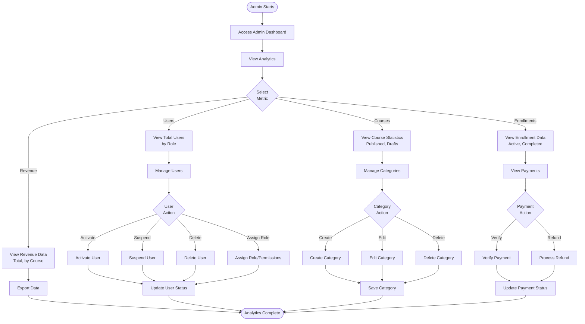
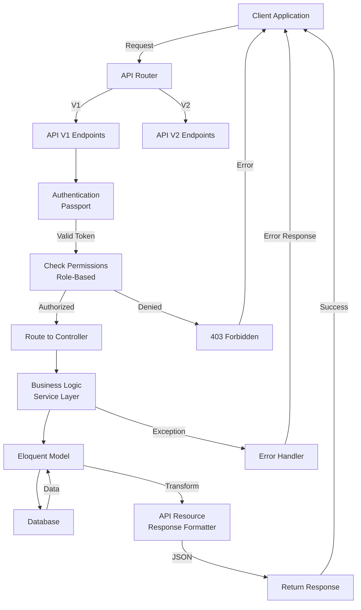

# Laravel API Kit - Activity Diagram

## Student Course Enrollment and Learning Flow

```mermaid
graph TD
    Start([Student Starts]) --> Browse["Browse Available Courses"]
    Browse --> Search{Search or<br/>Filter?}
    Search -->|Search| SearchCourses["Search by Title/Description"]
    Search -->|Filter| FilterCourses["Filter by Category/Level"]
    SearchCourses --> ViewCourse["View Course Details"]
    FilterCourses --> ViewCourse

    ViewCourse --> CheckPrice{Course<br/>Paid?}
    CheckPrice -->|Free| Enroll["Enroll in Course"]
    CheckPrice -->|Paid| Payment["Proceed to Payment"]
    Payment --> ProcessPayment["Process Payment"]
    ProcessPayment --> PaymentSuccess{Payment<br/>Successful?}
    PaymentSuccess -->|No| PaymentFailed["Payment Failed"]
    PaymentFailed --> ViewCourse
    PaymentSuccess -->|Yes| GenerateInvoice["Generate Invoice"]
    GenerateInvoice --> Enroll

    Enroll --> CreateEnrollment["Create Enrollment Record"]
    CreateEnrollment --> ViewLessons["View Course Lessons"]
    ViewLessons --> SelectLesson["Select Lesson"]
    SelectLesson --> ViewLesson["View Lesson Content"]
    ViewLesson --> CompleteLesson{Complete<br/>Lesson?}
    CompleteLesson -->|No| SelectLesson
    CompleteLesson -->|Yes| UpdateProgress["Update Lesson Progress"]
    UpdateProgress --> CheckAssignment{Assignment<br/>Available?}

    CheckAssignment -->|Yes| ViewAssignment["View Assignment"]
    ViewAssignment --> StartAssignment["Start Assignment<br/>Record Start Time"]
    StartAssignment --> SubmitAssignment["Submit Assignment"]
    SubmitAssignment --> CreateSubmission["Create Submission Record"]
    CreateSubmission --> NotifyTeacher["Notify Teacher"]
    NotifyTeacher --> WaitGrading["Wait for Grading"]
    WaitGrading --> GradeReceived{Grade<br/>Received?}
    GradeReceived -->|No| WaitGrading
    GradeReceived -->|Yes| ViewGrade["View Grade & Feedback"]
    ViewGrade --> CheckMoreLessons

    CheckAssignment -->|No| CheckMoreLessons{More<br/>Lessons?}
    CheckMoreLessons -->|Yes| SelectLesson
    CheckMoreLessons -->|No| CheckCompletion["Check Course Completion"]

    CheckCompletion --> AllLessonsComplete{All Lessons<br/>Completed?}
    AllLessonsComplete -->|No| SelectLesson
    AllLessonsComplete -->|Yes| CheckPassingScore{Passing<br/>Score Met?}

    CheckPassingScore -->|No| End1([Course Not Completed])
    CheckPassingScore -->|Yes| GenerateCertificate["Generate Certificate"]
    GenerateCertificate --> IssueCertificate["Issue Certificate"]
    IssueCertificate --> UpdateEnrollment["Update Enrollment Status"]
    UpdateEnrollment --> End2([Course Completed Successfully])
```

## Teacher Course Creation with AI Assistance

```mermaid
graph TD
    Start([Teacher Starts]) --> CreateCourse["Create New Course"]
    CreateCourse --> AddCourseDetails["Add Course Details<br/>Title, Description, Price"]
    AddCourseDetails --> SelectCategory["Select Category"]
    SelectCategory --> SetLevel["Set Course Level"]
    SetLevel --> SaveCourse["Save Course as Draft"]

    SaveCourse --> AddLessons["Add Lessons to Course"]
    AddLessons --> CreateLesson["Create Lesson"]
    CreateLesson --> AddLessonContent["Add Lesson Content"]

    AddLessonContent --> UseAI{Use AI<br/>Assistance?}
    UseAI -->|Yes| AIGenerate["AI Generate Content<br/>Based on Topic"]
    AIGenerate --> ReviewContent["Review AI Content"]
    ReviewContent --> EditContent["Edit/Refine Content"]
    EditContent --> SaveLesson
    UseAI -->|No| SaveLesson["Save Lesson"]

    SaveLesson --> AddResources{Add<br/>Resources?}
    AddResources -->|Yes| UploadResource["Upload Resource<br/>PDF, Video, etc"]
    UploadResource --> MoreResources{More<br/>Resources?}
    MoreResources -->|Yes| UploadResource
    MoreResources -->|No| MoreLessons
    AddResources -->|No| MoreLessons{More<br/>Lessons?}
    MoreLessons -->|Yes| CreateLesson
    MoreLessons -->|No| AddAssignments["Add Assignments"]

    AddAssignments --> CreateAssignment["Create Assignment"]
    CreateAssignment --> SetTimeLimit["Set Time Limit<br/>Optional"]
    SetTimeLimit --> AddQuestions["Add Questions"]

    AddQuestions --> UseAIQuestions{Use AI to<br/>Generate?}
    UseAIQuestions -->|Yes| AIGenerateQuestions["AI Generate Questions<br/>Based on Content"]
    AIGenerateQuestions --> ReviewQuestions["Review Questions"]
    ReviewQuestions --> EditQuestions["Edit Questions"]
    EditQuestions --> SaveQuestions
    UseAIQuestions -->|No| CreateQuestion["Create Question Manually"]
    CreateQuestion --> SaveQuestions["Save Questions"]

    SaveQuestions --> MoreAssignments{More<br/>Assignments?}
    MoreAssignments -->|Yes| CreateAssignment
    MoreAssignments -->|No| PublishCourse["Publish Course"]

    PublishCourse --> WaitEnrollments["Wait for Student Enrollments"]
    WaitEnrollments --> CheckSubmissions{Student<br/>Submissions?}
    CheckSubmissions -->|No| WaitEnrollments
    CheckSubmissions -->|Yes| ViewSubmission["View Student Submission"]
    ViewSubmission --> UseAutoGrade{Use AI<br/>Auto-Grade?}
    UseAutoGrade -->|Yes| AIGrade["AI Auto-Grade<br/>Submission"]
    AIGrade --> ReviewGrade["Review AI Grade"]
    ReviewGrade --> AdjustGrade["Adjust if Needed"]
    AdjustGrade --> ProvideFeedback
    UseAutoGrade -->|No| ManualGrade["Grade Manually"]
    ManualGrade --> ProvideFeedback["Provide Feedback"]

    ProvideFeedback --> SaveGrade["Save Grade & Feedback"]
    SaveGrade --> NotifyStudent["Notify Student"]
    NotifyStudent --> MoreSubmissions{More<br/>Submissions?}
    MoreSubmissions -->|Yes| ViewSubmission
    MoreSubmissions -->|No| End([Grading Complete])
```

## Admin Dashboard and Analytics Flow

## API Versioning and Request Flow

