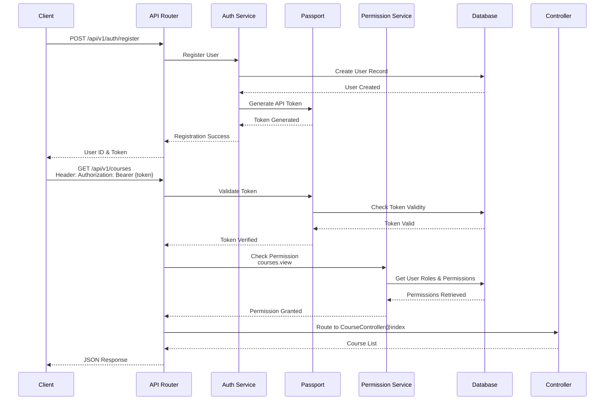
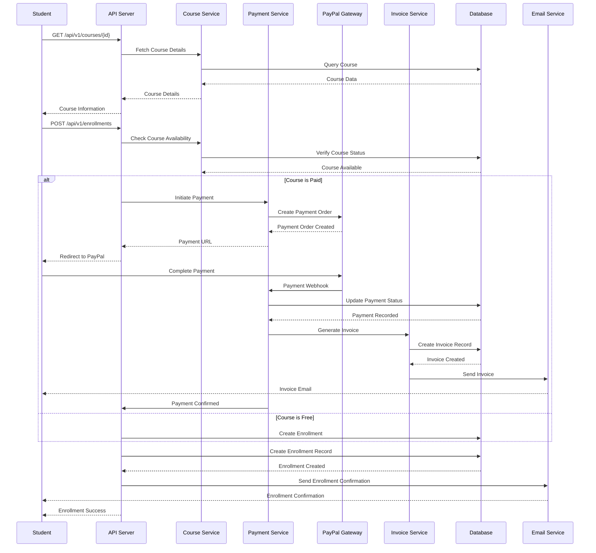
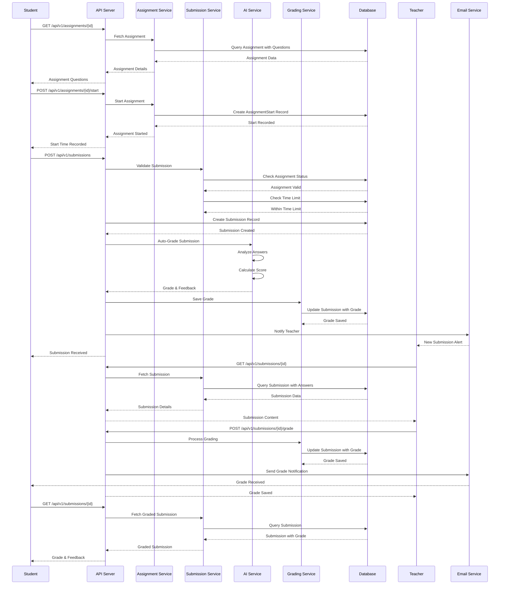
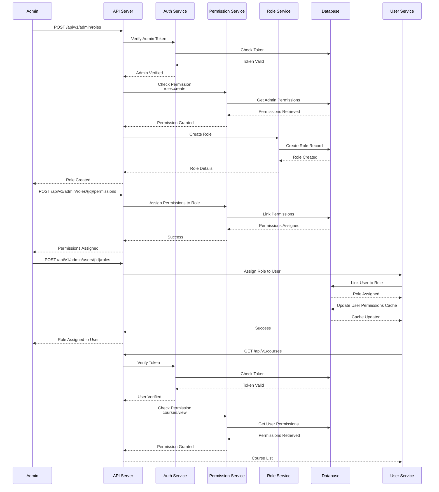
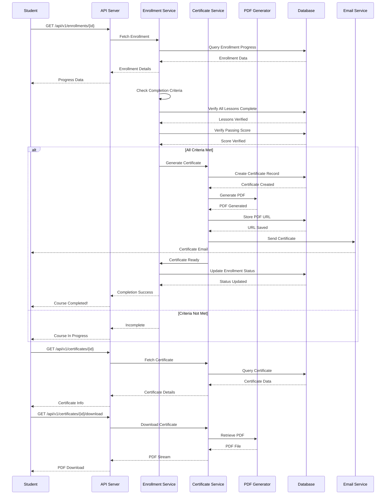

# Laravel API Kit - Sequence Diagram

## API V1 Authentication and Authorization Flow

## Student Enrollment with Payment Processing

## Assignment Submission with AI Auto-Grading

## Role-Based Access Control Flow

## Certificate Generation and Completion Flow

